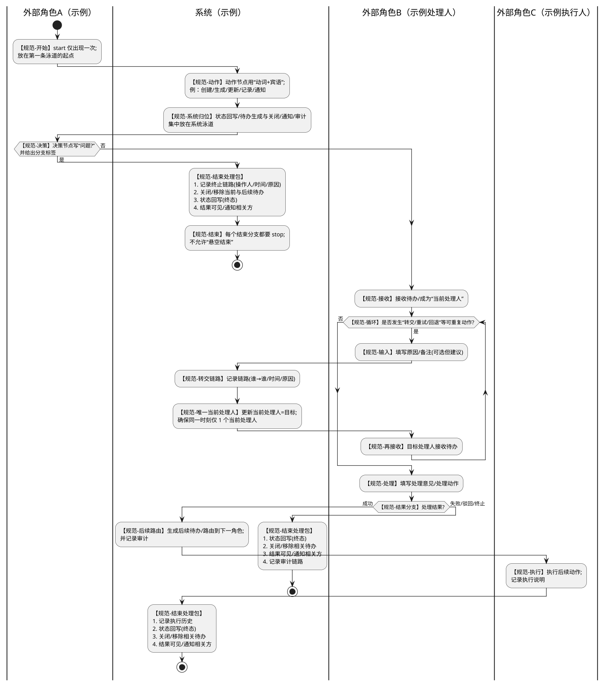

```plantuml
@startuml

' 目标：把“绘图规范”直接体现在流程图节点里（不绑定任何具体业务/功能）。
' 泳道建议：外部角色放两侧，系统放中间；关键状态/待办/通知/审计统一放系统泳道。

skinparam dpi 120

|外部角色A（示例）|
start
:【规范-开始】start 仅出现一次;\n放在第一条泳道的起点;

|系统（示例）|
:【规范-动作】动作节点用“动词+宾语”;\n例：创建/生成/更新/记录/通知;
:【规范-系统归位】状态回写/待办生成与关闭/通知/审计\n集中放在系统泳道;

|外部角色A（示例）|
if (【规范-决策】决策节点写“问题?”\n并给出分支标签) then (是)
  |系统（示例）|
  :【规范-结束处理包】\n1. 记录终止链路(操作人/时间/原因)\n2. 关闭/移除当前与后续待办\n3. 状态回写(终态)\n4. 结果可见/通知相关方;
  :【规范-结束】每个结束分支都要 stop;\n不允许“悬空结束”;
  stop
else (否)
endif

|外部角色B（示例处理人）|
:【规范-接收】接收待办/成为“当前处理人”;
while (【规范-循环】是否发生“转交/重试/回退”等可重复动作?) is (是)
  :【规范-输入】填写原因/备注(可选但建议);
  |系统（示例）|
  :【规范-转交链路】记录链路(谁→谁/时间/原因);
  :【规范-唯一当前处理人】更新当前处理人=目标;\n确保同一时刻仅 1 个当前处理人;
  |外部角色B（示例处理人）|
  :【规范-再接收】目标处理人接收待办;
endwhile (否)

:【规范-处理】填写处理意见/处理动作;
if (【规范-结果分支】处理结果?) then (成功)
  |系统（示例）|
  :【规范-后续路由】生成后续待办/路由到下一角色;\n并记录审计;

  |外部角色C（示例执行人）|
  :【规范-执行】执行后续动作;\n记录执行说明;

  |系统（示例）|
  :【规范-结束处理包】\n1. 记录执行历史\n2. 状态回写(终态)\n3. 关闭/移除相关待办\n4. 结果可见/通知相关方;
  stop
else (失败/驳回/终止)
  |系统（示例）|
  :【规范-结束处理包】\n1. 状态回写(终态)\n2. 关闭/移除相关待办\n3. 结果可见/通知相关方\n4. 记录审计链路;
  stop
endif

@enduml
```
