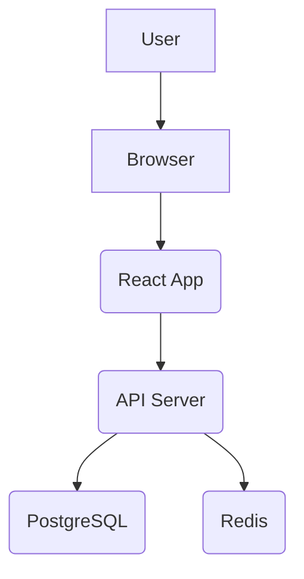

# 高质量、高效率的现代化软件项目开发与管理指南

您提出的问题非常核心：在按功能或任务进行垂直切分的敏捷开发模式下，如何保证软件设计的整体高质量和一致性。这确实是许多高效团队面临的挑战。

传统的横向分层设计（后端、数据库、前端）虽然能保证各层内部的专业性和完整性，但在快速迭代和功能交付时容易造成沟通壁垒和集成问题。

**核心理念：** 我们将采用“**垂直切片 (Vertical Slice)**”的设计与开发理念。每个功能作为一个独立的、可交付的单元，都包含其所需的前端、后端、数据库等所有层面的设计和实现。通过标准化的文档模板和清晰的目录结构，确保每个“垂直切片”都遵循统一的架构和规范，从而保证整体的质量。

这套方法论旨在让设计文档 **“尽可能精简、清晰，又能精确专业的指导大语言模型编程工具高质量的执行软件开发”**。

---

## 优化的目录结构树

一个清晰的目录结构是项目成功的基石。以下是一个推荐的结构，它将设计文档、源代码和测试清晰地分离开来，并以功能模块为中心组织。

```
.
├── .github/
│   └── workflows/          # CI/CD 自动化工作流
│       ├── lint.yml
│       └── test.yml
├── docs/
│   ├── ARCHITECTURE.md     # 整体架构设计（全局性、高层级）
│   ├── DATABASE.md         # 全局数据库设计（ER图、核心表结构）
│   ├── API.md              # 核心 API 设计与规范
│   └── features/           # 按功能/模块组织的设计文档
│       ├── 001-user-authentication/
│       │   ├── README.md   # 功能描述、用户故事、验收标准
│       │   ├── DESIGN.md   # 该功能的详细设计（UI/UX、API、数据模型）
│       │   └── MOCKUP.png  # (可选) 页面/流程草图
│       └── 002-product-management/
│           ├── README.md
│           └── DESIGN.md
├── src/                    # 源代码
│   ├── api/                # 后端/API
│   │   ├── components/     # 按功能模块组织的后端代码
│   │   │   ├── auth/
│   │   │   └── products/
│   │   ├── main.py
│   │   └── ...
│   ├── web/                # 前端
│   │   ├── components/     # 按功能模块组织的前端组件
│   │   │   ├── Auth/
│   │   │   └── Products/
│   │   ├── App.jsx
│   │   └── ...
│   └── shared/             # 前后端共享的代码/类型
├── tests/                  # 测试代码
│   ├── e2e/
│   └── unit/
├── .gitignore
├── package.json
└── README.md               # 项目根 README，包含项目简介、安装、启动方法
```

---

## 核心设计文档与“提示词”优化

以下是关键设计文档的说明，每一份文档本身就是一个结构化的“提示词 (Prompt)”，可以直接或稍加修改后交给大语言模型（如您正在使用的 Warp AI Agent）来执行开发任务。

### 1. 项目根 `README.md`

**目的**：提供项目的高层概览，让任何人（或AI）能快速了解项目背景和如何运行。

**模板/提示词**:
```markdown
# 项目名称：[你的项目名称]

## 1. 项目简介
[简要描述本项目的目标、核心价值和主要功能。]

## 2. 技术栈
- **后端**: [例如: Python (FastAPI), Node.js (Express)]
- **前端**: [例如: React, Vue, Svelte]
- **数据库**: [例如: PostgreSQL, MongoDB]
- **部署**: [例如: Docker, Kubernetes, Vercel]

## 3. 本地开发
### 3.1 环境准备
[列出必要的环境依赖，如 Node.js 版本、Python 版本等。]

### 3.2 安装
```bash
# 克隆仓库
git clone [your-repo-url]
cd [project-name]

# 安装后端依赖
pip install -r requirements.txt

# 安装前端依赖
npm install
```

### 3.3 运行
```bash
# 启动后端服务
uvicorn src.api.main:app --reload

# 启动前端开发服务器
npm run dev
```
```

### 2. `docs/ARCHITECTURE.md`

**目的**：定义项目的宏观架构、设计原则和组件交互方式。这是保证所有“垂直切片”遵循统一规范的关键。

**模板/提示词**:
```markdown
# 系统架构设计

## 1. 设计哲学
- **松耦合**: 各功能模块应尽可能独立。
- **高内聚**: 每个模块内部完成一项独立的业务。
- **单一职责原则**: 每个组件/函数只做一件事。

## 2. 核心组件图
[这里可以放一个 ASCII、Mermaid 或图片链接，描述核心服务、数据库、缓存、消息队列等如何交互。]


## 3. 数据流
[描述一个典型的请求是如何在系统中流转的。例如：用户登录请求。]

## 4. 技术选型理由
[简要说明为什么选择当前的技术栈，以及它们各自的职责。]
```

### 3. 功能设计文档 `docs/features/XXX/DESIGN.md` (核心！)

**目的**：这是“垂直切片”的核心。它将一个功能的所有设计要素集中在一起，是指导AI进行具体编码的最重要文档。

**模板/提示词**:
```markdown
# 功能模块设计：[功能名称，如：用户认证]

## 1. 功能概述 (Overview)
- **目标**: [一句话描述这个功能要解决什么问题。]
- **用户故事 (User Stories)**:
  - 作为一名 [用户角色], 我想要 [完成某个动作], 以便 [获得某种价值]。
  - (示例) 作为一名新用户, 我想要通过邮箱和密码注册账号, 以便能够登录系统。

## 2. UI/UX 设计 (Frontend)
- **页面/组件**: [列出需要的页面和核心组件。例如: LoginPage.jsx, RegisterForm.jsx]
- **交互流程**: [描述用户操作流程。例如: 1. 用户访问 /login -> 2. 输入邮箱密码 -> 3. 点击登录按钮 -> 4. 成功后跳转到 /dashboard，失败则提示错误。]
- **状态管理**: [需要管理的全局或局部状态。例如: `currentUser`, `isAuthenticated`, `isLoading`。]

## 3. API 接口设计 (Backend)
- **Endpoints**:
  - `POST /api/auth/register`
    - **描述**: 用户注册
    - **请求体 (Request Body)**: `{ "email": "user@example.com", "password": "securepassword123" }`
    - **成功响应 (Success Response, 201 Created)**: `{ "userId": "uuid-v4", "email": "user@example.com" }`
    - **失败响应 (Error Response, 400 Bad Request)**: `{ "error": "Email already exists." }`
  - `POST /api/auth/login`
    - ... (类似结构)

## 4. 数据模型设计 (Database)
- **涉及的表/集合**: `users`
- **`users` 表结构**:
  - `id`: UUID, Primary Key
  - `email`: VARCHAR(255), Unique, Not Null
  - `password_hash`: VARCHAR(255), Not Null
  - `created_at`: TIMESTAMP, Default NOW()
- **数据关系**: [描述与其他表的关系，例如：一个用户可以有多个订单。]

## 5. 验收标准/测试要点 (Acceptance Criteria / Tests)
- [ ] 用户可以使用有效的邮箱和密码成功注册。
- [ ] 不能使用已存在的邮箱进行注册。
- [ ] 密码在存入数据库前必须被哈希。
- [ ] 用户登录成功后，应返回一个 JWT Token。
```

---

## 如何使用这套方案指导大语言模型

1.  **全局设计先行**：首先，与AI（或团队）一起完成 `docs/ARCHITECTURE.md` 和 `docs/DATABASE.md` 的主体设计。这定义了项目的“交通规则”。
2.  **创建功能设计**: 当开发一个新功能时（如“商品管理”），在 `docs/features/` 下创建新目录，并完成 `DESIGN.md`。
3.  **分块下发指令**: 将 `DESIGN.md` 的内容分块作为提示词交给AI。
    *   **第一步 (数据库)**: “请根据以下数据模型设计，为`products`表创建数据库迁移文件。” (提供`## 4. 数据模型设计`部分)
    *   **第二步 (后端API)**: “请根据以下API接口设计，在`src/api/components/products/`目录下实现对应的路由和逻辑。请遵循项目架构，将业务逻辑、数据访问和路由处理分离开。” (提供`## 3. API 接口设计`部分)
    *   **第三步 (前端)**: “请根据以下UI/UX设计和API定义，创建`src/web/components/Products/`下的React组件。组件需要能调用API、展示商品列表并处理用户交互。” (提供`## 2. UI/UX 设计`和`## 3. API 接口设计`部分)
    *   **第四步 (测试)**: “请为刚刚创建的API和前端组件编写单元测试和集成测试，确保满足以下验收标准。” (提供`## 5. 验收标准`部分)

通过这种方式，每个开发任务都具备了高质量、上下文完整的设计输入，AI（或人类开发者）可以精确、高效地完成编码工作，同时保证了所有功能模块在整体架构上的一致性。

